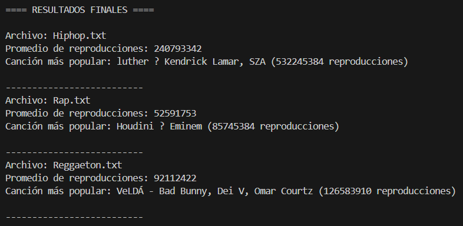
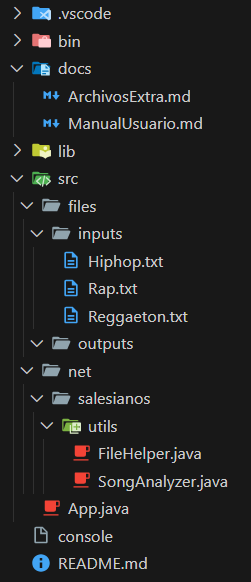
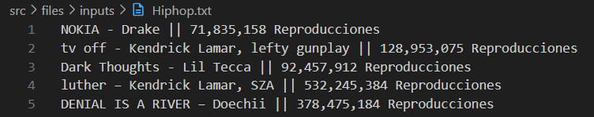

# Calculadora de Reproducciones Multiproceso

## 1. Necesidad empresarial

En una empresa musical o plataforma de streaming, es habitual manejar grandes cantidades de datos de canciones por género.  
Calcular métricas como promedio de reproducciones o canción más popular puede ser costoso si se procesa secuencialmente.

Esta aplicación multiproceso permite procesar varios géneros en paralelo, reduciendo el tiempo de cálculo.

## 2. Funcionamiento de la aplicación

- El proceso principal (`App.java`) lee todos los archivos `.txt` de la carpeta `src/files/inputs`.
- Para cada archivo se lanza un subproceso (`SongAnalyzer.java`) que calcula:
  - La media de reproducciones de las canciones.
  - La canción más popular del archivo.
- Todos los subprocesos se ejecutan en paralelo y sus resultados se muestran en la consola.

> Ejemplo de ejecución:
>
> ```bash
> javac -d bin src/net/salesianos/utils/*.java src/App.java
> java -cp bin App
> ```

## 3. Manual de Usuario

### Requisitos

- Java 17 o superior.
- Carpeta de entrada con archivos `.txt` en `src/files/inputs`.

### Preparación de archivos de entrada

- Cada archivo representa un género musical, por ejemplo: `Hiphop.txt`, `Rap.txt`, `Reggaeton.txt`.
- Cada línea del archivo debe seguir este formato:

---

Ejemplo de contenido (`Hiphop.txt`):

NOKIA - Drake || 71,835,158 Reproducciones

tv off - Kendrick Lamar, lefty gunplay || 128,953,075 Reproducciones

Dark Thoughts - Lil Tecca || 92,457,912 Reproducciones

luther – Kendrick Lamar, SZA || 532,245,384 Reproducciones

DENIAL IS A RIVER – Doechii || 378,475,184 Reproducciones

---

### Capturas de pantalla

A continuación se muestran ejemplos de la aplicación en funcionamiento y la estructura del proyecto.

- **Ejecución en consola:**  
  Muestra los resultados finales de cada archivo `.txt` procesado por los subprocesos.

  

- **Estructura de carpetas del proyecto:**  
  Carpeta `src/` con el código, `bin/` con los compilados y `docs/` con la documentación.

  

- **Contenido de un archivo de entrada:**  
  Ejemplo de un archivo `.txt` con canciones y sus reproducciones.

  
